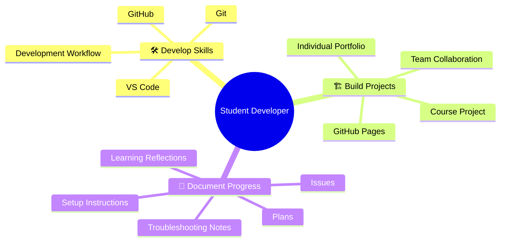
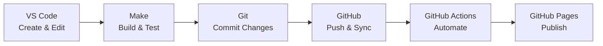
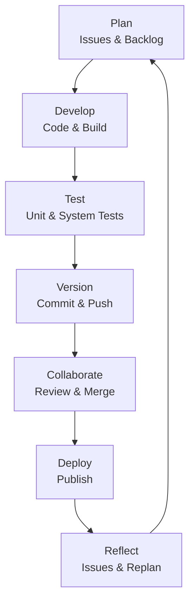
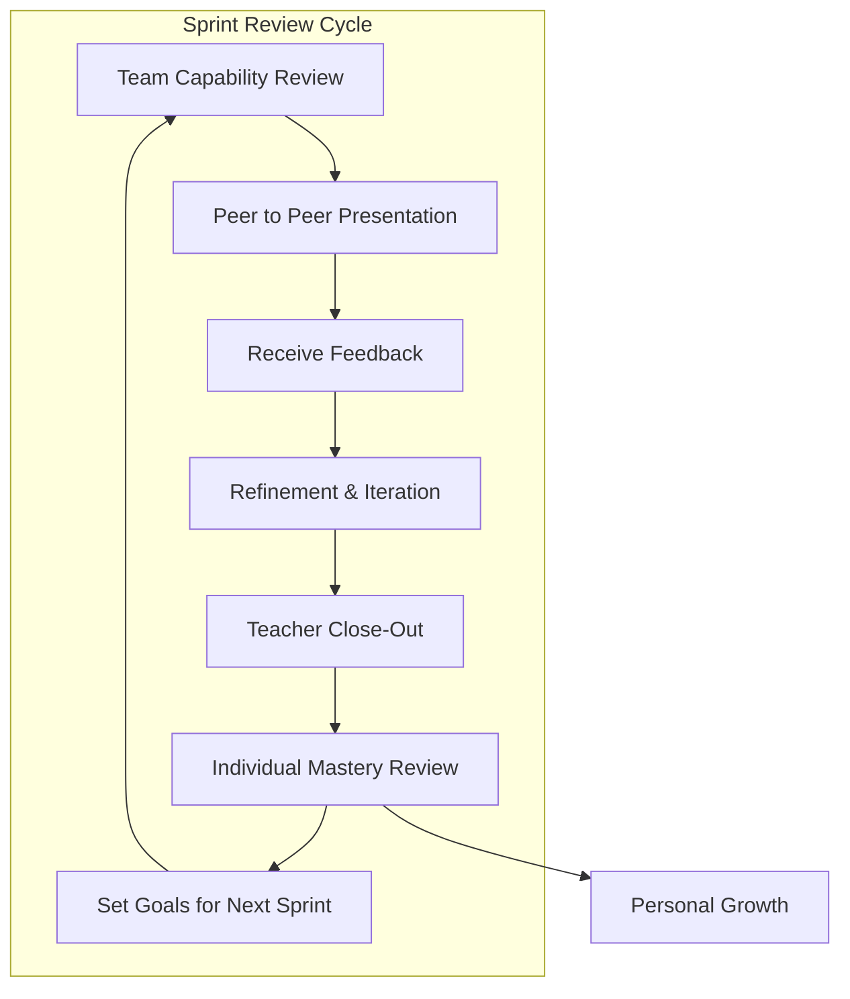

# Onboarding Challenge - Ground 0 - Yiming Yin
## Student Developer Mindmap

## Workflow Diagrams

### Tool Workflow

### Software Development Lifecycle (SDLC)

### Sprint Review Cycle

## Tables

### What You Already Know

| You've Used                  | Now You'll Use It As a Developer           |
| ---------------------------- | ------------------------------------------ |
| **Rubrics**                  | Define what "good" looks like              |
| **Checklists**               | Build repeatable processes                 |
| **Assessments**              | Test whether something works               |
| **Feedback**                 | Improve your work                          |
| **Teamwork**                 | Collaborate on a real project              |
| **Creative Problem Solving** | Find solutions when there is no answer key |

### The Foundation (Tools)

| Tool                    | What It Does                                                          |
| ----------------------- | ---------------------------------------------------------------------- |
| **VS Code**             | Write and edit Markdown, JavaScript, and other project files          |
| **VS Code Marketplace** | Find and install extensions that improve your development environment |
| **Make**                | Automate repetitive development tasks                                 |
| **Git**                 | Track changes and build a history of your work                        |
| **GitHub**              | Store, share, and collaborate on your code                            |
| **GitHub Actions**      | Automatically build, test, and publish your projects                  |
| **GitHub Pages**        | Publish your web projects                                              |

### Development Practices

| Practice                | Purpose                                                                                                                          |
| ------------------------ | --------------------------------------------------------------------------------------------------------------------------------- |
| **Tools & Equipment**   | The development environment used to build, test, and deploy software.                                                            |
| **GitHub Pages**        | The framework for a web project — pages, layouts, Markdown, HTML, JavaScript, and how everything connects.                       |
| **Agile Methodologies** | How teams organize work, make decisions, and select project teams. A key focus of Agile is to use short cycles and iterate often |
| **Sprint Framework**    | How work is organized into short, focused development cycles with checkpoints.                                                   |

### Onboarding Objectives - Readiness Checklist

| Section | Ready? |
| :---: | :---: |
| 1. Understand the Challenge | |
| I understand that the goal was not simply to install tools, but to learn how to work through an unfamiliar development environment. | ✅ |
| I can identify at least one problem I encountered and explain how I solved or investigated it. | ✅ |
| I have documented something that could help another student. | ✅ |
| I have a story about how forming a team, positives and challenges. | ✅ |
| I have a story about starting a team project, positives and challenges. | ✅ |
| I can explain the Onboarding Objectives in my own words. | ✅ |
| 2. My Development Environment | |
| I can open my development environment and begin working without waiting for someone else. | ✅ |
| I can edit and preview the files I will use in my course. | ✅ |
| I can use Git/GitHub to commit and push my work. | ✅ |
| I know where to find the tool setup and troubleshooting guides. | ✅ |
| I know how to ask for help when I am stuck. | ✅ |
| I have a working strategy for my personal computer and development environment. | ❌ |
| 3. My GitHub Workflow | |
| I can locate my GitHub repository. | ✅ |
| I can create an issue in my GitHub repository location. | ✅ |
| I can commit a change in GitHub. | ✅ |
| I can create or edit a file in VS Code. | ✅ |
| I can commit and sync changes from VS Code to GitHub. | ✅ |
| I know about GitHub Actions and can determine if my site is working. | ✅ |
| I know how to load my GitHub Pages portfolio site in my browser. | ✅ |
| 4. Forming the Team | |
| Before Forming the Team | |
| I have completed or reviewed the team formation process. | ✅ |
| I have read an article on selecting effective development teams. | ❌ |
| I have identified my persona, skills, interests, and strengths in OCS. | ✅ |
| I understand the expectation for diversity of skills, interests, and perspectives when forming teams. | ❌ |
| I have considered which teammates I may work well with. | ✅ |
| I have sat in proximity to potential teammates. | ✅ |
| Establishing the Team | |
| I know my team members' names. | ✅ |
| We have discussed our skills, interests, and perspectives. | ✅ |
| We have established a team communication channel. | ✅ |
| I have shared my preferred contact method with my teammates. | ✅ |
| We have established a team Agile manifesto and communication protocols. | ❌ |
| Beginning to Operate as a Team | |
| We have identified the coding challenges required for our course. | ✅ |
| We have created team and individual GitHub repositories. | ✅ |
| We have created team and individual GitHub issues, kanban, and milestones. | ✅ |
| We have begun team decision-making processes such as stand-ups, pin-ups, and burndowns. | ✅ |
| We have practiced Live Share, debugging, or pair programming. | ✅ |
| We have established a process for discussing problems and resolving issues. | ✅ |
| We have established our team contribution workflows: fork, branch, pull request, or direct collaboration as appropriate. | ✅ |
| We have identified how we will accept feedback and take action between checkpoints. | ✅ |
| 5. Beginning the Project | |
| I have participated in project ideation. | ✅ |
| I can describe at least one problem or project idea our team is considering. | ✅ |
| I have contributed an idea, question, research finding, or technical consideration. | ✅ |
| I have created or contributed to a GitHub issue related to our work. | ✅ |
| We have established our first project direction. | ✅ |
| I understand what tasks I am expected to accomplish before the next sprint checkpoint. | ✅ |
| We have identified what the team needs to accomplish before the next checkpoint. | ✅ |
| I know that presenting evidence is part of my responsibility as I work. | ✅ |

### Evaluation Matrix — Tools & Development Environment

| ID  | Area                     | Self Rank | Peer | Teacher |
| --- | ------------------------ | --------- | ---- | ------- |
| T01 | Development Environment  | 3         | =    | —       |
| T02 | VS Code                  | 4         | -    | —       |
| T03 | Git / GitHub             | 4         | +    | —       |
| T04 | Portfolio / GitHub Pages | 4         | —    | —       |

### Evaluation Matrix — Development & Creation

| ID  | Area                            | Self Rank | Peer | Teacher |
| --- | -------------------------------- | --------- | ---- | ------- |
| T05 | Tools & Equipment Hacks         | 4         | -    | —       |
| T06 | Portfolio / Blogging Hacks      | 3         | +    | —       |
| T07 | Theme / Style / Layout          | 3         | —    | —       |
| T08 | JavaScript / Coding Challenges  | 3         | +    | —       |
| T09 | AI Orchestration                | 4         | +    | —       |

### Evaluation Matrix — Technical Awareness & Communication

| ID  | Area                       | Self Rank | Peer | Teacher |
| --- | --------------------------- | --------- | ---- | ------- |
| T10 | Tech / Cyber Growth        | 4         | =    | —       |
| T11 | Learning Through Mistakes  | 4         | —    | —       |
| T12 | Tech / Cyber Talk          | 3         | +    | —       |

### Technical Ranking Guidelines

| Rank  | Description                                                                                        |
| ----- | --------------------------------------------------------------------------------------------------- |
| **0** | **Not Entered** — No self-assessment has been entered yet.                                          |
| **1** | **Explore** — I have encountered or experimented with this technology or skill.                    |
| **2** | **Understand** — I can explain it and perform basic tasks with support.                             |
| **3** | **Apply** — I can use it independently in my project work.                                          |
| **4** | **Analyze / Evaluate** — I can troubleshoot problems, compare approaches, and improve my solution.  |
| **5** | **Create / Extend** — I can independently customize, extend, or create solutions using the skill.   |

*Peer / Teacher Calibration: `−` = below self-assessment · `=` = consistent with self-assessment · `+` = above self-assessment*

### Professional Evaluation Matrix — Core Behaviors

| ID  | Area               | Self Rank | Peer | Teacher |
| --- | ------------------- | --------- | ---- | ------- |
| P01 | Attendance / Tardy | 5         | =    | —       |
| P02 | Work Habits        | 4         | -    | —       |
| P03 | Integrity          | 4         | +    | —       |

### Professional Evaluation Matrix — Collaboration

| ID  | Area                 | Self Rank | Peer | Teacher |
| --- | --------------------- | --------- | ---- | ------- |
| P04 | Communication        | 3         | =    | —       |
| P05 | Help Seeking         | 4         | =    | —       |
| P06 | Mentoring / Advocacy | 3         | =    | —       |

### Professional Evaluation Matrix — Professional Skills

| ID  | Area         | Self Rank | Peer | Teacher |
| --- | ------------- | --------- | ---- | ------- |
| P07 | Timeliness   | 3         | —    | —       |
| P08 | Persistence  | 3         | +    | —       |
| P09 | Organization | 4         | —    | —       |
| P10 | Engagement   | 3         | +    | —       |

### Professional Ranking Guidelines

| Rank  | Description                                                                                  |
| ----- | ---------------------------------------------------------------------------------------------- |
| **0** | **Not Entered** — No self-assessment has been entered yet.                                    |
| **1** | **Beginning** — I am beginning to recognize and practice this behavior.                       |
| **2** | **Developing** — I demonstrate this behavior sometimes, usually with reminders or support.    |
| **3** | **Consistent** — I regularly demonstrate this behavior independently.                         |
| **4** | **Strong** — I consistently demonstrate this behavior and adjust when circumstances change.   |
| **5** | **Model** — I consistently demonstrate this behavior and help others develop it.              |

*Peer / Teacher Calibration: `−` = below self-assessment · `=` = consistent with self-assessment · `+` = above self-assessment*